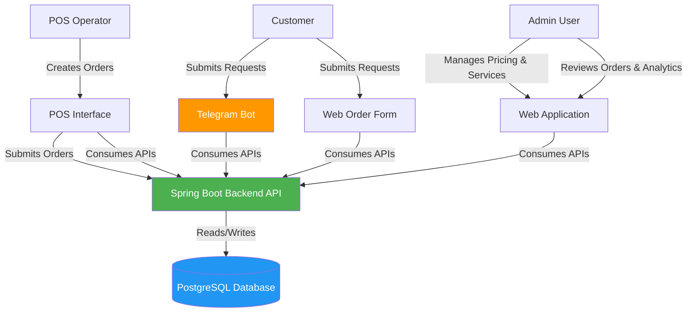
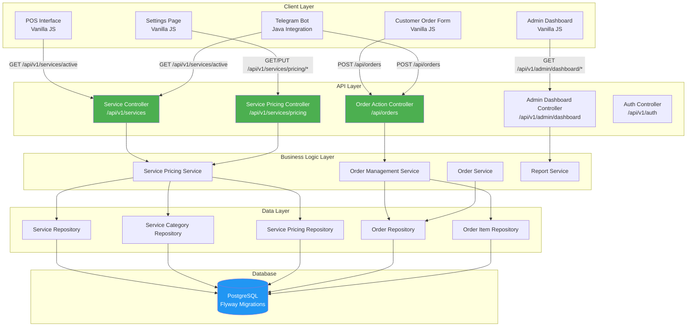
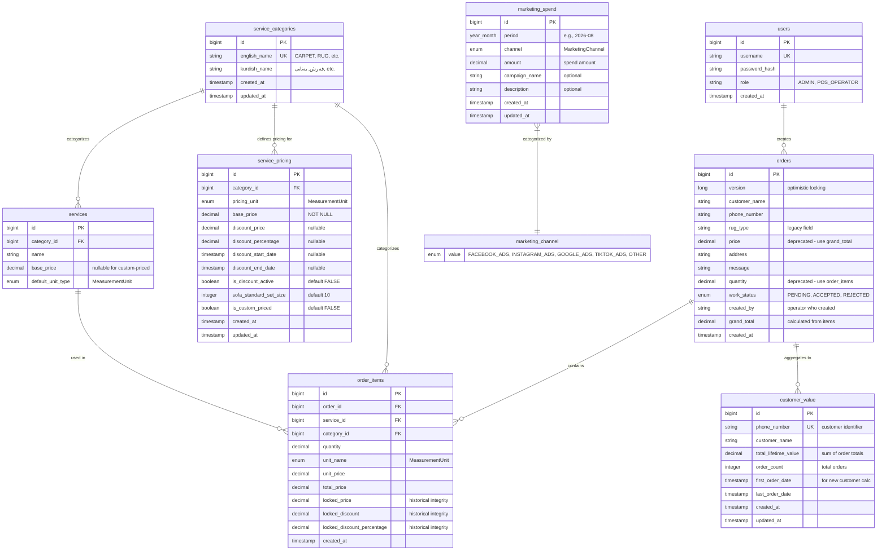
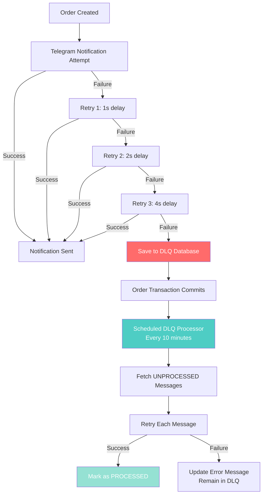

# System Architecture Document
## Service Management System - Cleaning Company (Kurdistan)

**Document Version:** 4.2  
**Last Updated:** 2026-08-10  
**Status:** SINGLE SOURCE OF TRUTH

---

## 1. System Context & C4 Architecture

### 1.1 System Boundaries & Actors

**Primary Actors:**
- **Admin:** Manages pricing, services, and orders via Dashboard and Settings pages
- **POS Operator:** Creates orders via POS interface for walk-in customers
- **Customer:** Submits service requests via Telegram Bot or web order form

**System Boundaries:**
- **Ghasl Service Management System:** Core business logic, pricing engine, order management
- **PostgreSQL Database:** Persistent data storage with ACID compliance
- **Telegram Bot Integration:** External customer-facing interface
- **Web Interfaces:** POS, Dashboard, Settings pages (Vanilla JS)

### 1.2 C4 Level 1: System Context Diagram



### 1.3 C4 Level 2: Container Diagram



---

## 2. Core Domain Models & Database Schema

### 2.1 Entity Relationship Diagram (ERD)



### 2.2 Core Domain Entities

#### 2.2.1 ServiceCategory
**Purpose:** Represents high-level service categories (Carpet, Rug, Blanket, etc.)  
**Table:** `service_categories`

**Key Fields:**
- `id`: Primary key
- `englishName`: Unique uppercase identifier (e.g., "CARPET", "SOFA")
- `kurdishName`: Localized display name (e.g., "فەرش", "قەنەفە")
- `createdAt`, `updatedAt`: Audit timestamps

**Business Rules:**
- `englishName` must be unique and uppercase
- Used as foreign key in both `services` and `service_pricing` tables
- Enables dynamic service creation without code changes

#### 2.2.2 Service
**Purpose:** Represents specific service offerings within a category  
**Table:** `services`

**Key Fields:**
- `id`: Primary key
- `category`: Many-to-one relationship to ServiceCategory
- `name`: Service display name
- `basePrice`: Nullable base price (null for custom-priced services)
- `defaultUnitType`: MeasurementUnit enum for default pricing unit

**Business Rules:**
- Must have a valid category relationship
- `basePrice` can be null for services requiring on-site pricing
- `defaultUnitType` ensures type safety across the system

#### 2.2.3 ServicePricing
**Purpose:** Central pricing configuration with discount support  
**Table:** `service_pricing`

**Key Fields:**
- `id`: Primary key
- `serviceCategory`: Many-to-one relationship to ServiceCategory
- `pricingUnit`: MeasurementUnit enum (PER_METER, PER_PIECE, etc.)
- `basePrice`: Current standard price (NOT NULL)
- `discountPrice`: Promotional price (nullable)
- `discountPercentage`: Calculated discount percentage (nullable)
- `discountStartDate`, `discountEndDate`: Validity period (nullable)
- `isDiscountActive`: Boolean flag for discount activation
- `sofaStandardSetSize`: Standard set size for per-person calculation (default: 10)
- `isCustomPriced`: Flag for services requiring manual pricing

**Business Rules:**
- `basePrice` is mandatory for all services
- Discount is active only when `isDiscountActive = true` AND current date is within validity period
- Sofa services use per-person pricing: `basePrice / sofaStandardSetSize`
- Custom-priced services bypass automatic pricing calculation

#### 2.2.4 Order
**Purpose:** Represents a customer order with work status tracking  
**Table:** `orders`

**Key Fields:**
- `id`: Primary key
- `version`: Optimistic locking version field
- `customerName`, `phoneNumber`: Customer identification
- `address`, `message`: Additional order details
- `workStatus`: Enum (PENDING, ACCEPTED, REJECTED)
- `createdBy`: Operator/employee who created the order (MANDATORY for auditing)
- `grandTotal`: Calculated total from order items
- `createdAt`: Order timestamp

**Business Rules:**
- `createdBy` is mandatory - anonymous orders are prohibited
- `grandTotal` is recalculated by backend from verified database prices
- Optimistic locking via `version` field prevents concurrent modification conflicts
- Legacy fields (`price`, `quantity`, `rugType`) deprecated for POS orders

#### 2.2.5 OrderItem
**Purpose:** Line items within an order supporting multi-service orders  
**Table:** `order_items`

**Key Fields:**
- `id`: Primary key
- `order`: Many-to-one relationship to Order
- `service`: Many-to-one relationship to Service
- `serviceCategory`: Many-to-one relationship to ServiceCategory
- `quantity`: Quantity of units (e.g., 3.5 meters, 2 pieces)
- `unitName`: MeasurementUnit enum for this specific line item
- `unitPrice`: Price per unit at time of order
- `totalPrice`: Calculated line total (quantity × unitPrice)
- `lockedPrice`, `lockedDiscount`, `lockedDiscountPercentage`: Historical pricing snapshot

**Business Rules:**
- All pricing fields are locked at order creation for audit trail
- Backend recalculates `totalPrice` for verification
- Supports mixed units within a single order

#### 2.2.6 MeasurementUnit (Enum)
**Purpose:** Type-safe measurement units across the entire system

**Values:**
- `PER_METER`: Linear meter pricing
- `PER_PIECE`: Per-item pricing
- `PER_PERSON`: Per-person pricing (sofa sets)
- `COUNT`: Integer count
- `HOURLY`: Hourly rate
- `PER_SQUARE_METER`: Area-based pricing
- `PER_KILOGRAM`: Weight-based pricing
- `PER_LITER`: Volume-based pricing
- `JOB`: Fixed job pricing

**Business Rules:**
- Replaces primitive String usage for unit types
- Used in Service, ServicePricing, OrderItem entities
- Enables type-safe unit validation in frontend

#### 2.2.7 MarketingSpend
**Purpose:** Tracks marketing/advertising expenses by period and channel  
**Table:** `marketing_spend`

**Key Fields:**
- `id`: Primary key
- `period`: YearMonth for which the spend applies (e.g., 2026-08)
- `channel`: MarketingChannel enum (FACEBOOK_ADS, INSTAGRAM_ADS, GOOGLE_ADS, OTHER)
- `amount`: Total spend amount for the period and channel
- `campaignName`: Optional campaign identifier
- `description`: Optional description of the marketing activity
- `createdAt`, `updatedAt`: Audit timestamps

**Business Rules:**
- Used for calculating Customer Acquisition Cost (CAC)
- Multiple records can exist per period (one per channel)
- Summed by period for total ad spend calculations
- Updated via strict REPLACE/OVERWRITE logic (see Section 3.3)

#### 2.2.8 CustomerValue
**Purpose:** Tracks cumulative customer lifetime value per customer  
**Table:** `customer_value`

**Key Fields:**
- `id`: Primary key
- `phoneNumber`: Unique customer identifier (phone number)
- `customerName`: Customer name for reference
- `totalLifetimeValue`: Sum of all order totals for this customer
- `orderCount`: Total number of orders placed by this customer
- `firstOrderDate`: Date of first order (used for "new customer" calculation)
- `lastOrderDate`: Date of most recent order
- `createdAt`, `updatedAt`: Audit timestamps

**Business Rules:**
- Aggregated via Spring Events (OrderSubmittedEvent) - NO database triggers
- Used for calculating Customer Lifetime Value (CLV)
- First-time customers identified by `firstOrderDate` within a specific period
- Updated asynchronously when new orders are created

#### 2.2.9 MarketingChannel (Enum)
**Purpose:** Categorizes marketing/advertising channels

**Values:**
- `FACEBOOK_ADS`: Facebook advertising
- `INSTAGRAM_ADS`: Instagram advertising
- `GOOGLE_ADS`: Google Ads
- `TIKTOK_ADS`: TikTok advertising
- `OTHER`: Other marketing channels (manual entries, etc.)

**Business Rules:**
- Used in MarketingSpend entity for channel categorization
- Enables per-channel spend analysis
- Default channel for manual user input: OTHER

---

## 3. API Contracts & Centralized Logic

### 3.1 Zero Trust Architecture Principle

**CRITICAL RULE:** Spring Boot Backend is the **ONLY** source of truth for business logic. All financial calculations (totals, discounts, per-person pricing) MUST be performed by the backend. Frontend calculations are for UI display ONLY and must never be trusted for persistence.

### 3.2 Backend Core Principles (NEW RULES)

#### 3.2.1 Event-Driven Aggregation (No Database Triggers)

**CRITICAL RULE:** All business logic and data aggregation (e.g., updating customer lifetime value when a new order is placed) MUST be handled in the Java application layer using Spring Application Events. **The use of Database Triggers for business logic is strictly forbidden** to maintain the Java backend as the Single Source of Truth.

**Implementation Pattern:**

```java
// Event Publisher (OrderManagementService)
@Service
public class OrderManagementService {
    private final ApplicationEventPublisher eventPublisher;
    
    public Order createOrder(OrderRequestDTO request) {
        Order order = // ... create order logic
        orderRepository.save(order);
        
        // Publish event for downstream processing
        eventPublisher.publishEvent(new OrderSubmittedEvent(this, order));
        
        return order;
    }
}

// Event Listener (CustomerValueEventListener)
@Component
public class CustomerValueEventListener {
    @EventListener
    @Async  // Process asynchronously to avoid blocking order creation
    public void handleOrderSubmitted(OrderSubmittedEvent event) {
        Order order = event.getOrder();
        
        // Update customer lifetime value
        CustomerValue customerValue = customerValueRepository
            .findByPhoneNumber(order.getPhoneNumber())
            .orElse(new CustomerValue());
        
        customerValue.addOrderValue(order.getGrandTotal());
        customerValueRepository.save(customerValue);
    }
}
```

**Business Rules:**
- Use `@EventListener` annotation for event handling
- Use `@Async` for non-blocking event processing
- Events must be published after transaction commit for data consistency
- NO database triggers for business logic - all logic in Java
- Event listeners can be disabled or modified without database changes
- Enables testing and debugging of business logic in Java layer

#### 3.2.2 Strict Upsert/Overwrite Logic for Configuration Metrics

**CRITICAL RULE:** When updating configuration or periodic metrics (like Monthly Ad Spend), the backend must strictly UPDATE/OVERWRITE the existing record for that period rather than accumulating/adding to it. This prevents the "Addition vs. Replacement" bug where new values are incorrectly added to existing totals.

**Implementation Pattern:**

```java
@Service
public class MarketingReportService {
    @Transactional
    public void updateMarketingSpend(MarketingSpendUpdateRequest request) {
        YearMonth targetPeriod = getTargetPeriod(request.getPeriod());
        
        // DELETE ALL existing records for this period (strict replacement)
        List<MarketingSpend> existingRecords = 
            marketingSpendRepository.findByPeriodOrderByChannelAsc(targetPeriod);
        
        if (!existingRecords.isEmpty()) {
            marketingSpendRepository.deleteAll(existingRecords);
        }
        
        // INSERT single new record with user's exact amount
        MarketingSpend newSpend = new MarketingSpend();
        newSpend.setPeriod(targetPeriod);
        newSpend.setChannel(MarketingChannel.OTHER);
        newSpend.setAmount(request.getAmount());
        marketingSpendRepository.save(newSpend);
    }
}
```

**Business Rules:**
- Use `@Transactional` to ensure atomic delete+insert operation
- Delete ALL existing records for the period before insertion
- Never add to existing values - always replace
- Prevents string concatenation bugs (e.g., "300" + "300" = "300300")
- Ensures user input is the single source of truth for the period

### 3.3 Core API Endpoints

#### 3.3.1 Service Management APIs

**GET /api/v1/services/active**
**Purpose:** Returns all active services with current pricing (Single Source of Truth for all clients)  
**Response:** `ActiveServiceDTO[]`

```json
[
  {
    "id": 1,
    "coreServiceId": 1,
    "englishName": "CARPET",
    "kurdishName": "فەرش",
    "measurementUnit": "PER_METER",
    "activePrice": 1250.00,
    "discountedPrice": 1000.00,
    "discountActive": true,
    "customPriced": false,
    "sofaStandardSetSize": null,
    "iconUrl": "fa-rug"
  }
]
```

**Business Logic:**
- Backend calculates `activePrice` based on current discount status
- Backend determines `discountActive` based on date range and flag
- Frontend MUST use these values for display; never calculate locally

**POST /api/v1/services/new**
**Purpose:** Creates a new service category with default pricing  
**Request:** `NewServiceRequest`

```json
{
  "kurdishName": "خولانە",
  "englishName": "CURTAINS",
  "basePrice": 1500.00,
  "pricingUnit": "PER_METER",
  "sofaStandardSetSize": null,
  "isCustomPriced": false
}
```

**Business Logic:**
- `@Transactional` ensures ACID compliance
- Creates ServiceCategory, Service, and ServicePricing atomically
- Returns 409 CONFLICT if category already exists

#### 3.3.2 Pricing Management APIs

**GET /api/v1/services/pricing/all**
**Purpose:** Returns all pricing configurations for Settings page  
**Response:** `ServicePricingResponse[]`

**PUT /api/v1/services/pricing/{id}**
**Purpose:** Updates pricing configuration  
**Request:** `ServicePricingUpdateRequest`

```json
{
  "basePrice": 1300.00,
  "isDiscountActive": true,
  "discountPrice": 1100.00,
  "discountPercentage": 15.38,
  "discountStartDate": "2026-08-01T00:00:00",
  "discountEndDate": "2026-08-31T23:59:59",
  "sofaStandardSetSize": 10
}
```

**Business Logic:**
- Backend validates discount date ranges
- Backend auto-calculates `discountPercentage` if not provided
- Updates propagate immediately to all clients via `/api/v1/services/active`

#### 3.3.3 Order Management APIs

**POST /api/orders**
**Purpose:** Creates a new order from POS or customer form  
**Request:** `OrderRequestDTO`

```json
{
  "customerName": "محمد ئەحمەد",
  "phoneNumber": "07501234567",
  "address": "هەولێر، شەقامی 100 مەتر",
  "notes": "پاککردنەوەی بەهێز",
  "createdBy": "admin",
  "items": [
    {
      "serviceId": 1,
      "quantity": 3.5
    },
    {
      "serviceId": 2,
      "quantity": 2
    }
  ]
}
```

**Business Logic (CRITICAL):**
- Backend fetches current pricing from database
- Backend recalculates `unitPrice` and `totalPrice` for each item
- Backend calculates `grandTotal` from verified prices
- Frontend `unitPrice` and `totalPrice` in request are IGNORED
- Returns created order with backend-calculated prices

**Response:**

```json
{
  "id": 123,
  "grandTotal": 6375.00,
  "status": "success",
  "message": "Order created successfully"
}
```

**POST /api/orders/{id}/accept**
**Purpose:** Accepts an order for processing  
**Response:** Updated `Order` entity

**Business Logic:**
- Uses optimistic locking via `version` field
- Returns 409 CONFLICT if concurrent modification detected
- Updates `workStatus` to ACCEPTED

**POST /api/orders/{id}/reject**
**Purpose:** Rejects an order  
**Response:** Updated `Order` entity

**Business Logic:**
- Uses optimistic locking
- Updates `workStatus` to REJECTED
- Excluded from revenue calculations

#### 3.3.4 Dashboard APIs

**GET /api/v1/admin/dashboard/summary?period={today|week|month}**
**Purpose:** Returns dashboard summary statistics  
**Response:** `DashboardSummaryResponse`

```json
{
  "customers": 45,
  "orders": 67,
  "weeklyGrowthPercent": 12.5,
  "monthlyGrowthPercent": 8.3,
  "profit": 1250000.00,
  "currency": "IQD"
}
```

**Business Logic:**
- Customers counted via session-based clustering (30-minute gap threshold)
- Orders counted from Lead repository (all submitted requests)
- Revenue calculated from confirmed orders only

**GET /api/v1/admin/dashboard/top-services?period={today|week|month}**
**Purpose:** Returns top services by order count  
**Response:** `TopServiceResponse[]`

**Business Logic:**
- Groups orders by `ServiceCategory.englishName`
- Dynamically fetches Kurdish names from `ServiceCategory`
- Aggregates beyond top 4 into "ئەوانی تر" (Others)

#### 3.3.5 Marketing ROI APIs

**GET /api/v1/admin/reports/marketing-roi?period={today|week|month}**
**Purpose:** Returns marketing ROI metrics for the gauge chart  
**Response:** `MarketingROIResponse`

```json
{
  "monthlyAdSpend": 300000.00,
  "newCustomers": 15,
  "customerAcquisitionCost": 20000.00,
  "averageCustomerLifetimeValue": 75000.00,
  "roiRatio": 3.75,
  "currency": "IQD",
  "period": "2026-08"
}
```

**Business Logic:**
- CAC = Total Monthly Ad Spend / New Customers
- CLV = System-wide average of customer lifetime values
- ROI Ratio = CLV / CAC
- New Customer = First-time customer within the requested period
- All calculations performed in backend (Zero Trust)

**POST /api/v1/admin/reports/marketing-spend**
**Purpose:** Updates marketing spend for a specific period  
**Request:** `MarketingSpendUpdateRequest`

```json
{
  "amount": 300000.00,
  "period": "month"
}
```

**Business Logic:**
- Uses strict REPLACE/OVERWRITE logic (see Section 3.2.2)
- Deletes all existing records for the period before insertion
- Prevents additive bugs and string concatenation
- Returns 200 OK on success

#### 3.3.6 Pareto Analysis APIs

**GET /api/v1/admin/reports/pareto-analysis?period={today|week|month}**
**Purpose:** Returns Pareto analysis data for service profit distribution (80/20 rule)  
**Response:** `ParetoAnalysisResponse`

```json
{
  "services": [
    {
      "englishName": "CARPET",
      "kurdishName": "فەرش",
      "absoluteProfit": 1250000.00,
      "cumulativeProfit": 1250000.00,
      "totalProfit": 5000000.00,
      "cumulativePercentage": 25.0
    }
  ],
  "currency": "IQD",
  "period": "month"
}
```

**Business Logic:**
- Uses PostgreSQL Window Functions for single-pass calculation
- Calculates absolute profit per service category
- Calculates cumulative profit and cumulative percentage
- Only includes ACCEPTED orders (excludes REJECTED and PENDING)
- Calendar-based periods: today (00:00-23:59), week (Monday-Sunday), month (1st-last day)
- All calculations performed in backend (Zero Trust)

**Controller:** `ReportController` (`/api/v1/admin/reports`)
**Service:** `ReportService.getParetoAnalysis()`
**Repository:** `OrderRepository.getParetoAnalysisData()` (Native Query)

---

## 4. Database & Persistence Layer

### 4.1 PostgreSQL Native Query Requirement for Complex Analytics

**CRITICAL RULE:** For complex analytical queries requiring PostgreSQL-specific features (e.g., Window Functions, CTEs, advanced aggregations), standard JPQL is insufficient. These queries MUST be implemented as **Native SQL Queries** using `nativeQuery = true` in Spring Data JPA repositories.

**Rationale:**
- JPQL does not support PostgreSQL Window Functions (`SUM() OVER()`, `ROW_NUMBER()`, etc.)
- Native queries provide direct access to database-specific optimizations
- Single-pass window functions eliminate N+1 query performance issues
- Type-safe mapping handled in Service layer with defensive casting

**Implementation Pattern:**

```java
@Repository
public interface OrderRepository extends JpaRepository<Order, Long> {

    @Query(value = "SELECT " +
           "sc.english_name, " +
           "sc.kurdish_name, " +
           "SUM(oi.total_price) as absolute_profit, " +
           "SUM(SUM(oi.total_price)) OVER (ORDER BY SUM(oi.total_price) DESC) as cumulative_profit, " +
           "SUM(SUM(oi.total_price)) OVER () as total_profit, " +
           "(SUM(SUM(oi.total_price)) OVER (ORDER BY SUM(oi.total_price) DESC) * 100.0 / " +
           " NULLIF(SUM(SUM(oi.total_price)) OVER (), 0)) as cumulative_percentage " +
           "FROM order_items oi " +
           "JOIN service_categories sc ON oi.category_id = sc.id " +
           "JOIN orders o ON oi.order_id = o.id " +
           "WHERE o.work_status = 'ACCEPTED' " +
           "AND o.created_at >= :startDate " +
           "AND o.created_at < :endDate " +
           "GROUP BY sc.english_name, sc.kurdish_name " +
           "ORDER BY absolute_profit DESC",
           nativeQuery = true)
    List<Object[]> getParetoAnalysisData(
        @Param("startDate") LocalDateTime startDate,
        @Param("endDate") LocalDateTime endDate
    );
}
```

**Service Layer Defensive Casting:**

```java
@Transactional(readOnly = true)
public ParetoAnalysisResponse getParetoAnalysis(String period) {
    List<Object[]> rawData = orderRepository.getParetoAnalysisData(startDate, endDate);

    List<ParetoAnalysisDTO> dtos = rawData.stream()
        .map(row -> {
            // Safely convert any numeric type (Double, Long, BigInteger, etc.) to BigDecimal
            BigDecimal absoluteProfit = row[2] != null ? new BigDecimal(row[2].toString()) : BigDecimal.ZERO;
            BigDecimal cumulativeProfit = row[3] != null ? new BigDecimal(row[3].toString()) : BigDecimal.ZERO;
            BigDecimal totalProfit = row[4] != null ? new BigDecimal(row[4].toString()) : BigDecimal.ZERO;
            BigDecimal cumulativePercentage = row[5] != null ? new BigDecimal(row[5].toString()) : BigDecimal.ZERO;

            return new ParetoAnalysisDTO(englishName, kurdishName, absoluteProfit, cumulativeProfit, totalProfit, cumulativePercentage);
        })
        .collect(Collectors.toList());

    return new ParetoAnalysisResponse(dtos, "IQD", period);
}
```

**Business Rules:**
- Use actual PostgreSQL table and column names (snake_case), not JPA entity names
- Window functions enable efficient single-pass cumulative calculations
- Service layer must handle type conversion defensively (toString → BigDecimal)
- Native queries bypass JPQL limitations for database-specific features
- All analytical endpoints requiring complex aggregations use this pattern

---

## 5. Frontend State Management (Vanilla JS Strict Rules)

### 5.1 State Management Pattern: Observer-like with Global State Objects

**PRINCIPLE:** All frontend state must be stored in well-defined global objects. DOM updates must be derived from state changes, not direct DOM manipulation.

### 5.2 Global State Structure

#### 5.2.1 POS State (`pos.js`)

```javascript
// Global state for POS cart
let posCart = [];

// Global state for services (Single Source of Truth from API)
let posServicesState = {
  services: [],
  loaded: false
};
```

**Rules:**
- `posCart` is the single source of truth for cart items
- `posServicesState.services` is populated once from `/api/v1/services/active`
- All cart operations (add, remove, edit) update `posCart` array
- `renderCart()` completely rebuilds DOM from `posCart` state
- No direct DOM manipulation outside `renderCart()`

#### 5.2.2 Customer Form State (`dynamic-services.js`)

```javascript
// Global state for services (Single Source of Truth)
window.GhaslServicesState = {
  services: [],
  cart: {
    items: [],
    total: 0
  }
};
```

**Rules:**
- `window.GhaslServicesState.services` populated from `/api/v1/services/active`
- `window.GhaslServicesState.cart.items` tracks selected services
- `calculateCartTotal()` updates `cart.total` from item quantities
- `renderCart()` and `renderDynamicInputs()` rebuild DOM from state

### 5.3 State-Driven UI Updates

**PRINCIPLE:** DOM updates must be reactive to state changes. When state changes, call render functions to rebuild affected DOM sections.

#### 5.3.1 Cart Rendering Pattern

```javascript
// Render Cart Function (State-driven UI - completely rebuilds from cart array)
function renderCart() {
  // Clear cart container completely
  cartItemsContainer.innerHTML = '';

  // Check if cart is empty
  if (posCart.length === 0) {
    cartItemsContainer.innerHTML = `<div class="pos-cart-empty">...</div>`;
    grandTotalElement.textContent = '0 IQD';
    executeOrderBtn.disabled = true;
    return;
  }

  // Calculate grand total from state (Zero Trust: UI display only)
  let grandTotal = 0;
  posCart.forEach(item => {
    grandTotal = Math.round((grandTotal + item.totalPrice) * 100) / 100;
  });

  // Render each cart item based on current state
  posCart.forEach(item => {
    const cartItemHTML = `<div class="pos-cart-item" data-row-id="${item.rowId}">...</div>`;
    cartItemsContainer.innerHTML += cartItemHTML;
  });

  // Update grand total display
  grandTotalElement.textContent = grandTotal.toFixed(2) + ' IQD';
  executeOrderBtn.disabled = false;
}
```

**Rules:**
- Always clear container before rendering
- Rebuild entire DOM from state array
- No incremental DOM updates (avoids state desynchronization)
- Use `rowId` for targeted operations (edit, delete)

#### 5.3.2 Event Delegation Pattern

**PRINCIPLE:** Use event delegation on parent containers instead of attaching listeners to dynamic elements.

```javascript
// Event Delegation for Dynamic Service Cards
document.getElementById('services-grid').addEventListener('click', (e) => {
  const card = e.target.closest('.pos-service-card');
  if (card) {
    openServiceModal(card);
  }
});
```

**Rules:**
- Single listener on parent container
- Use `e.target.closest()` to find dynamic elements
- Avoid attaching listeners to dynamically created elements

### 5.4 Dynamic Service Fetching Pattern

**PRINCIPLE:** Fetch services once on page load and store in global state. All UI components read from this state.

```javascript
async function fetchAndRenderServices() {
  const servicesGrid = document.getElementById('services-grid');

  try {
    // Fetch from unified Active Services API (Single Source of Truth)
    const response = await fetch('/api/v1/services/active');
    if (!response.ok) {
      throw new Error('Failed to fetch services: ' + response.status);
    }

    const services = await response.json();
    
    // Store in global state for reuse
    posServicesState.services = services;
    posServicesState.loaded = true;

    // Clear loading state
    servicesGrid.innerHTML = '';

    // Dynamically generate service cards using safe DOM manipulation
    services.forEach(service => {
      const card = createPosServiceCard(service);
      servicesGrid.appendChild(card);
    });

  } catch (error) {
    console.error('Error fetching services:', error);
    servicesGrid.innerHTML = `<div class="pos-error-state">...</div>`;
  }
}
```

**Rules:**
- Fetch once on `DOMContentLoaded`
- Store in global state for reuse
- Use safe DOM manipulation (`createElement`, not `innerHTML` with unsanitized data)
- Handle loading and error states

### 5.5 Safe DOM Manipulation

**PRINCIPLE:** Never use `innerHTML` with unsanitized user data. Use `textContent` or `createElement` for security.

```javascript
// SAFE: Using textContent
name.textContent = service.kurdishName;

// SAFE: Using createElement
const card = document.createElement('div');
card.className = 'pos-service-card';

// UNSAFE: Using innerHTML with user data
card.innerHTML = `<div>${userInput}</div>`; // NEVER DO THIS
```

**Rules:**
- Use `textContent` for text content
- Use `createElement` for DOM structure
- Use `innerHTML` only with trusted static HTML
- Escape user input before HTML injection (use helper function)

### 5.6 Global Utility Functions for Usability

**PRINCIPLE:** Common usability enhancements should be implemented as global utility functions that apply across all pages without requiring per-page implementation.

#### 5.6.1 Eastern Arabic Numeral Conversion

**Purpose:** Automatically converts Eastern Arabic/Persian numerals (٠-٩, ۰-۹) to standard Western digits (0-9) in all input fields for proper JavaScript processing.

**Implementation:** `global-utils.js`

```javascript
// Global interceptor for Eastern Arabic/Kurdish numerals
document.addEventListener('input', function(e) {
  if (e.target.tagName === 'INPUT' || e.target.tagName === 'TEXTAREA') {
    const arabicToEnglishMap = {
      '٠': '0', '١': '1', '٢': '2', '٣': '3', '٤': '4',
      '٥': '5', '٦': '6', '٧': '7', '٨': '8', '٩': '9',
      '۰': '0', '۱': '1', '۲': '2', '۳': '3', '۴': '4',
      '۵': '5', '۶': '6', '۷': '7', '۸': '8', '۹': '9'
    };

    let originalValue = e.target.value;
    let normalizedValue = originalValue.replace(/[٠-٩۰-۹]/g, function(match) {
      return arabicToEnglishMap[match];
    });

    if (originalValue !== normalizedValue) {
      // Update the value seamlessly without losing cursor position
      const start = e.target.selectionStart;
      const end = e.target.selectionEnd;
      e.target.value = normalizedValue;
      e.target.setSelectionRange(start, end);
    }
  }
});
```

**Business Rules:**
- Applied globally via event delegation on `document`
- Preserves cursor position during conversion
- Supports both Eastern Arabic (٠-٩) and Persian (۰-۹) numeral sets
- Must be included in all HTML pages via `<script src="js/global-utils.js"></script>`

#### 5.6.2 Mouse Wheel Prevention on Number Inputs

**Purpose:** Prevents accidental value changes when scrolling the page past number input fields.

**Implementation:** `global-utils.js`

```javascript
// Disable mouse wheel scrolling on number inputs
document.addEventListener('wheel', function(e) {
  if (e.target.type === 'number') {
    e.preventDefault();
    e.target.blur();
  }
}, { passive: false });
```

**Business Rules:**
- Uses `{ passive: false }` to allow `preventDefault()` call
- Blurs input on wheel event to prevent further accidental changes
- Applied globally via event delegation
- Must be included in all HTML pages via `global-utils.js`

### 5.7 Admin Authentication & Navigation Pattern

**PRINCIPLE:** Admin menu toggle functionality must be consistently implemented across all admin pages (Dashboard, POS, Report, Settings).

**Implementation Pattern:**

```javascript
// ---- Admin Authentication Logic ----
var adminMenu = document.getElementById("adminMenu");
var adminToggle = document.getElementById("adminToggle");
var adminDropdown = document.querySelector(".admin-dropdown");
var logoutBtn = document.getElementById("logoutBtn");

function setAuthenticatedState(isAuthenticated) {
    if (isAuthenticated) {
        if(adminMenu) adminMenu.classList.remove("hidden");
    } else {
        if(adminMenu) adminMenu.classList.add("hidden");
    }
}

// Check auth state on load
fetch("/api/v1/auth/check", { method: "GET" })
    .then(function(res) {
        if(res.ok) {
            setAuthenticatedState(true);
        }
    })
    .catch(console.error);

if (adminToggle) {
    adminToggle.addEventListener("click", function (e) {
        e.stopPropagation();
        var isHidden = adminDropdown.classList.toggle("hidden");

        if (!isHidden) {
            // Position dropdown at toggle button's location
            var rect = adminToggle.getBoundingClientRect();
            adminDropdown.style.top = (rect.bottom + 4) + "px";
            adminDropdown.style.right = (window.innerWidth - rect.right) + "px";
        }
    });
}

// Close dropdown when clicking outside
document.addEventListener("click", function (e) {
    if (adminMenu && !e.target.closest("#adminMenu") && !adminDropdown.classList.contains("hidden")) {
        adminDropdown.classList.add("hidden");
    }
});

if (logoutBtn) {
    logoutBtn.addEventListener("click", function () {
        fetch("/api/v1/auth/logout", { method: "POST" })
            .then(function() {
                setAuthenticatedState(false);
                adminDropdown.classList.add("hidden");
            });
    });
}
```

**Business Rules:**
- Must be included in all admin page JavaScript files (dashboard.js, pos.js, report.js, settings.js)
- Uses `/api/v1/auth/check` to determine authentication state
- Dropdown positioned dynamically based on toggle button location
- Click-outside behavior for closing dropdown
- Logout functionality via `/api/v1/auth/logout`

**CSS Requirements:** (`dashboard.css`)

```css
.admin-toggle {
    display: flex;
    align-items: center;
    gap: 0.5rem;
    padding: 0.5rem 1rem;
    background: white;
    border: 1px solid rgba(14, 44, 77, 0.15);
    border-radius: 0.5rem;
    cursor: pointer;
    font-family: 'Arkan Favorit', sans-serif !important;
    font-weight: 500;
    font-size: 0.9rem;
    color: #0f2440;
    transition: all 0.2s ease;
}

.admin-toggle:hover {
    background: #eaf6ff;
    border-color: #2fa8c9;
}

.admin-toggle i {
    font-size: 1rem;
}
```

### 5.8 Responsive Design Patterns

#### 5.8.1 Mobile-Only Image Display

**Purpose:** Display certain images (e.g., promotional graphics) only on mobile devices while hiding them on desktop.

**Implementation:** CSS with media query

```css
.mobile-only-image {
    display: block;
}

@media (min-width: 1024px) {
    .mobile-only-image {
        display: none !important;
    }
}
```

**HTML Usage:**

```html

```

**Business Rules:**
- Uses CSS class `.mobile-only-image` for consistent behavior
- Hidden on screens 1024px and wider (desktop/tablet)
- Visible on screens below 1024px (mobile)
- `!important` ensures override of any conflicting styles

### 5.9 Cart Ordering Pattern (Newest on Top)

**Purpose:** Display newly added cart items at the top of the list instead of bottom for better UX in POS interface.

**Implementation:** Array manipulation + DOM insertion

```javascript
// Add to cart array (newest first)
posCart.unshift(newItem);

// DOM rendering - use prepend instead of appendChild
if (!itemEl) {
    itemEl = createCartItemElement(item);
    cartItemsContainer.prepend(itemEl);  // Add to top (newest first)
}
```

**Business Rules:**
- Use `.unshift()` instead of `.push()` for array insertion
- Use `.prepend()` instead of `.appendChild()` for DOM insertion
- Applies to POS cart only (not customer order form)
- Newest items appear at index 0 (top of list)

### 5.10 State Preservation on DOM Re-render

**Purpose:** Preserve user input (e.g., quantity values) when DOM is re-rendered due to state changes.

**Implementation:** Two-way data binding

```javascript
// Input change event - update global state
input.addEventListener('input', (e) => {
    updateItemQuantity(item.id, e.target.value);
});

// Render function - restore state from global object
const input = document.createElement('input');
input.type = 'number';
input.id = `quantity-${item.id}`;
input.value = item.quantity || '';  // Preserve state from cart
```

**Business Rules:**
- Input events must update global state object immediately
- Render functions must set input values from preserved state
- Applies to customer order form (dynamic-services.js)
- Prevents data loss when selecting multiple services

### 5.11 Dashboard Widget Pattern

**PRINCIPLE:** UI components should be encapsulated in unified widget containers and laid out using CSS Grid/Flexbox to allow future scalability for multiple charts on a single dashboard.

**Widget Container Structure:**

```html
<!-- Widget Grid Container -->
<section class="widgets-grid">
  <!-- Individual Widget Card -->
  <div class="report-widget-card">
    <!-- Period Selector (Widget-specific) -->
    <div class="widget-period-selector">
      <div id="period-selector" class="period-selector">
        <button class="period-button" data-period="today">ڕۆژ</button>
        <button class="period-button active" data-period="week">هەفتە</button>
        <button class="period-button" data-period="month">مانگ</button>
      </div>
    </div>

    <!-- Widget Header -->
    <div class="widget-header">
      <h2>ئاماری قازانجی ڕێکلام و بەهای کڕیار</h2>
    </div>

    <!-- Widget Content (Metrics, Charts, etc.) -->
    <div class="metrics-row">
      <!-- Metric items -->
    </div>

    <!-- Gauge Chart Container -->
    <div class="gauge-container">
      <div id="gauge-chart-container">
        <!-- SVG gauge rendered via createElementNS -->
      </div>
    </div>
  </div>
</section>
```

**CSS Grid Layout:**

```css
/* Widget Grid Container */
.widgets-grid {
  display: grid;
  grid-template-columns: repeat(auto-fill, minmax(400px, 1fr));
  gap: 24px;
  align-items: start;
}

/* Individual Widget Card */
.report-widget-card {
  width: 100%;
  max-width: 450px;
  background-color: white;
  border-radius: 16px;
  padding: 24px;
  box-shadow: 0 4px 24px -4px rgba(0, 0, 0, 0.08);
  border: 1px solid #e2e8f0;
}
```

**Business Rules:**
- Each widget is self-contained with its own period selector and content
- CSS Grid `auto-fill` with `minmax(400px, 1fr)` enables responsive widget layout
- Complex analytical charts (e.g., Pareto Analysis) MUST use full-width grid spans (`grid-column: 1 / -1`) for readability
- All widget data flows through Global State Object pattern
- SVG charts rendered using `createElementNS` for safe DOM manipulation (no external charting libraries)
- Zero `innerHTML` for dynamic user/API data in widgets
- Event Delegation used for all widget interactions (period selector, save buttons, etc.)

**SVG Rendering Pattern:**

```javascript
// Render Pareto Chart using createElementNS (Vanilla JS, no libraries)
function renderParetoChart() {
    const container = document.getElementById('pareto-chart-container');
    const svgNS = "http://www.w3.org/2000/svg";
    
    const svg = document.createElementNS(svgNS, "svg");
    svg.setAttribute("width", String(width));
    svg.setAttribute("height", String(height));
    
    // Draw bars, lines, axes using createElementNS
    data.forEach((d, i) => {
        const rect = document.createElementNS(svgNS, "rect");
        rect.setAttribute("x", String(x));
        rect.setAttribute("y", String(y));
        rect.setAttribute("fill", "#1e293b");
        svg.appendChild(rect);
    });
    
    container.appendChild(svg);
}
```

**Business Rules:**
- All charts use Vanilla JavaScript SVG rendering via `createElementNS`
- No external charting libraries (Chart.js, D3.js, etc.) to maintain lightweight architecture
- Defensive dimension fallbacks: `width = container.clientWidth || 800`
- Try-catch blocks around SVG generation for error handling
- Kurdish RTL support via `dir="rtl"` and proper text alignment

---

## 6. Error Handling & Static Resource Management

### 6.1 Static Resource Not Found Handling

**Purpose:** Prevent log spam from missing static resources (e.g., favicon.ico) while maintaining proper error logging for critical issues.

**Implementation:** GlobalExceptionHandler.java

```java
import org.springframework.web.servlet.resource.NoResourceFoundException;

@ExceptionHandler(NoResourceFoundException.class)
public ResponseEntity<Object> handleNoResourceFoundException(
        NoResourceFoundException ex,
        WebRequest request) {
    logger.warn("Resource not found: {}", ex.getMessage());

    Map<String, Object> body = new HashMap<>();
    body.put("timestamp", LocalDateTime.now());
    body.put("status", HttpStatus.NOT_FOUND.value());
    body.put("error", "Not Found");
    body.put("message", "The requested resource was not found");
    body.put("path", request.getDescription(false).replace("uri=", ""));

    return new ResponseEntity<>(body, HttpStatus.NOT_FOUND);
}
```

**Business Rules:**
- Logs as WARN (not ERROR) to reduce log noise
- Returns standard 404 Not Found response
- No full stack trace for static resource 404s
- Critical 404s (API endpoints) still logged as ERROR via generic handler

### 6.2 Favicon Management

**Purpose:** Stop browsers from automatically requesting favicon.ico to prevent 404 log entries.

**Implementation:** HTML `<head>` tag

```html
<link rel="icon" href="data:," />
```

**Business Rules:**
- Use data URI (`data:,`) to neutralize browser default behavior
- Must be added to all HTML pages (index.html, dashboard.html, report.html, settings.html, pos.html)
- When real favicon is designed, place at `src/main/resources/static/favicon.ico`
- Remove data URI link when real favicon is deployed

---

## 7. Development Policies & Standards

### 6.1 Strict Zero Destruction Policy

**CRITICAL RULE:** Existing, functional code must NEVER be overwritten, deleted, or modified without explicit auditing and permission. This policy applies to all layers: backend (Java), frontend (JavaScript/HTML/CSS), and database schemas.

**Rationale:**
- Prevents regression bugs from accidental code deletion
- Ensures existing features remain functional during new feature development
- Maintains system stability and reliability
- Enables safe parallel development

**Implementation Requirements:**

**Backend (Java):**
- Never delete or modify existing controller methods without explicit approval
- When adding new endpoints, create new controller classes or append to existing ones
- Use `@Deprecated` annotation for legacy methods before removal
- Maintain backward compatibility for existing API contracts
- Database migrations must be additive (never drop columns/tables without approval)

**Frontend (JavaScript/HTML/CSS):**
- Never delete existing widget HTML/CSS when adding new widgets
- Use CSS Grid/Flexbox for layout changes instead of modifying existing structure
- When refactoring rendering functions, preserve existing functionality
- Add new state objects instead of modifying existing ones
- Use defensive try-catch blocks in initialization to prevent crashes

**Audit Process:**
1. Identify all files that will be modified before making changes
2. Verify that existing functionality will not be broken
3. Test existing features after modifications
4. Document any breaking changes with explicit approval

**Violation Consequences:**
- Immediate rollback of changes
- Code review for root cause analysis
- Mandatory documentation of the incident
- Implementation of safeguards to prevent recurrence

---

## 8. Telegram Bot Integration Protocol

### 7.1 Bot Architecture Principle

**PRINCIPLE:** Telegram Bot consumes the SAME REST APIs as the web interfaces. No hardcoded service arrays or pricing logic in the bot.

### 7.2 Dynamic Service Menu Generation

**Protocol:**

1. **Fetch Active Services:** Bot calls `GET /api/v1/services/active` on startup
2. **Cache Services:** Store response in memory for menu generation
3. **Generate Inline Keyboard:** Create dynamic inline buttons from service list
4. **Handle Selection:** When user selects service, fetch current pricing again

**Implementation Pattern:**

```java
// Telegram Bot Service (Java)
public class TelegramBotService {
    
    private List<ActiveServiceDTO> cachedServices;
    
    @Scheduled(fixedRate = 300000) // Refresh every 5 minutes
    public void refreshServices() {
        ResponseEntity<ActiveServiceDTO[]> response = restTemplate.getForEntity(
            backendUrl + "/api/v1/services/active",
            ActiveServiceDTO[].class
        );
        cachedServices = Arrays.asList(response.getBody());
    }
}
```

**Business Rules:**
- Bot uses same API as web interfaces (Single Source of Truth)
- Services cached for performance, refreshed periodically
- No hardcoded service lists in bot code
- Pricing fetched dynamically from backend

**Implementation Pattern:**

```java
public String formatServicePrice(ActiveServiceDTO service) {
    if (service.isCustomPriced()) {
        return "نرخی دیاری نەکراوە";
    }
    
    if (service.isDiscountActive() && service.getDiscountedPrice() != null) {
        return String.format("Was: %s IQD\nNow: %s IQD (DISCOUNT)", 
            service.getActivePrice().longValue(),
            service.getDiscountedPrice().longValue());
    }
    
    return String.format("%s IQD / %s", 
        service.getActivePrice().longValue(),
        translateUnit(service.getMeasurementUnit()));
}
```

### 5.5 Error Handling & Retry Logic

**Protocol:**

1. **Network Errors:** Implement exponential backoff for failed API calls
2. **Validation Errors:** Display backend validation messages to user
3. **Service Unavailable:** Cache last known services and display with warning
4. **Order Conflicts:** Handle 409 CONFLICT responses with retry prompt

---

## 9. Feature Extensibility Protocol

### 6.1 The "Add a Feature" Checklist

**CRITICAL:** Follow this checklist strictly when adding new features or service categories to ensure automatic propagation across all interfaces.

### 6.2 Adding a New Cleaning Service Category

**Step 1: Database Layer (Zero Code Changes Required)**
- [ ] Use Settings page UI to create new service category
- [ ] Enter Kurdish name, English name, base price, pricing unit
- [ ] Submit form - this automatically creates:
  - `ServiceCategory` record
  - `Service` record  
  - `ServicePricing` record
- [ ] **NO SQL migration required** - dynamic architecture handles this

**Step 2: Backend Layer (Zero Code Changes Required)**
- [ ] Verify `GET /api/v1/services/active` returns new service
- [ ] Verify `ActiveServiceDTO` includes all required fields
- [ ] **NO Controller changes required** - generic service handling
- [ ] **NO Service changes required** - dynamic pricing calculation

**Step 3: POS Interface (Zero Code Changes Required)**
- [ ] Refresh POS page - new service card appears automatically
- [ ] Verify service card displays correct Kurdish name and price
- [ ] Verify unit label matches pricing unit (مەتر, دانە, etc.)
- [ ] Test adding service to cart and submitting order
- [ ] **NO HTML changes required** - dynamic service grid
- [ ] **NO JS changes required** - `fetchAndRenderServices()` handles new services

**Step 4: Customer Order Form (Zero Code Changes Required)**
- [ ] Refresh order form page - new service appears automatically
- [ ] Verify service card displays correctly
- [ ] Test adding service to cart and submitting order
- [ ] **NO HTML changes required** - dynamic service cards
- [ ] **NO JS changes required** - `fetchActiveServices()` handles new services

**Step 5: Telegram Bot (Zero Code Changes Required)**
- [ ] Wait for scheduled service refresh (5 minutes) or trigger manually
- [ ] Verify new service appears in bot menu
- [ ] Test selecting service and submitting order
- [ ] **NO Bot code changes required** - dynamic menu generation

**Step 6: Settings Page (Zero Code Changes Required)**
- [ ] Verify new service appears in pricing grid
- [ ] Test updating base price and discounts
- [ ] Verify changes propagate to POS and Bot
- [ ] **NO HTML changes required** - dynamic pricing cards
- [ ] **NO JS changes required** - `loadPricing()` handles new services

**Step 7: Dashboard (Zero Code Changes Required)**
- [ ] Create test orders with new service
- [ ] Verify service appears in top services chart
- [ ] Verify Kurdish name displays correctly
- [ ] **NO Dashboard changes required** - dynamic service aggregation

### 6.3 Adding a New Measurement Unit Type

**Step 1: Backend Layer**
- [ ] Add new value to `MeasurementUnit` enum in `MeasurementUnit.java`
- [ ] Update `UNIT_LABELS` mapping in `AdminDashboardController.translateUnit()`
- [ ] Update Kurdish unit mappings in frontend JS files:
  - `pos.js`: `UNIT_LABELS`, `UNIT_PLACEHOLDERS`, `UNIT_CONFIG`
  - `dynamic-services.js`: `UNIT_LABELS`, `UNIT_QUESTIONS`, `UNIT_CONFIG`
  - `settings.js`: `getUnitLabel()`

**Step 2: Database Layer**
- [ ] No migration required - enum stored as string in database
- [ ] Existing records continue to work with new enum values

**Step 3: Frontend Layer**
- [ ] Test new unit type in POS modal (quantity input validation)
- [ ] Test new unit type in customer form (quantity input validation)
- [ ] Verify Kurdish unit labels display correctly

### 6.4 Adding a New Discount Type

**Step 1: Database Layer**
- [ ] Use Settings page to configure discount for existing service
- [ ] Set discount price, percentage, start/end dates
- [ ] Enable `isDiscountActive` flag

**Step 2: Backend Layer**
- [ ] Verify `ServicePricing.isDiscountCurrentlyActive()` method handles new discount
- [ ] Verify `ServicePricingService.getActiveServices()` returns discounted price
- [ ] **NO code changes required** - existing discount logic handles all types

**Step 3: Frontend Layer**
- [ ] Refresh POS page - discount displays automatically
- [ ] Refresh customer form - discount displays automatically
- [ ] Refresh Telegram bot - discount displays automatically
- [ ] **NO code changes required** - discount display logic is generic

### 6.5 Adding a New API Endpoint

**Step 1: Define Contract**
- [ ] Document endpoint purpose, method, path
- [ ] Define request DTO structure
- [ ] Define response DTO structure
- [ ] Specify error responses (400, 401, 403, 404, 409, 500)

**Step 2: Implement Backend**
- [ ] Create DTO class in `dto` package
- [ ] Add method to appropriate Service class
- [ ] Add endpoint to appropriate Controller
- [ ] Add unit tests for new endpoint
- [ ] Update API documentation

**Step 3: Implement Frontend**
- [ ] Add API call function to appropriate JS file
- [ ] Implement error handling
- [ ] Add loading states
- [ ] Update UI to display new data
- [ ] Test integration end-to-end

**Step 4: Update Bot (If Required)**
- [ ] Add bot command handler if endpoint is bot-facing
- [ ] Implement API call in bot service
- [ ] Add error handling and retry logic
- [ ] Test bot integration

### 6.6 Modifying Business Logic

**PRINCIPLE:** All business logic changes must be made in the Backend Service layer. Frontend and Bot must consume the updated APIs without code changes.

**Step 1: Backend Layer**
- [ ] Identify affected Service class
- [ ] Modify business logic method
- [ ] Update unit tests
- [ ] Verify API responses reflect changes

**Step 2: Database Layer**
- [ ] Create Flyway migration if schema changes required
- [ ] Test migration on development database
- [ ] Verify backward compatibility if needed

**Step 3: Frontend Layer**
- [ ] Test affected pages with new logic
- [ ] Verify UI updates correctly from API responses
- [ ] **NO frontend logic changes required** if API contract unchanged

**Step 4: Bot Layer**
- [ ] Test bot with new logic
- [ ] Verify bot behavior matches web interfaces
- [ ] **NO bot logic changes required** if API contract unchanged

### 6.7 Validation Rules

**CRITICAL VALIDATION:** Before marking any feature as complete, verify:

- [ ] POS interface works correctly with new feature
- [ ] Customer order form works correctly with new feature
- [ ] Settings page can configure new feature
- [ ] Dashboard displays new feature data correctly
- [ ] Telegram Bot handles new feature correctly
- [ ] All interfaces use the SAME API endpoints
- [ ] No hardcoded data in any interface
- [ ] Business logic is ONLY in backend
- [ ] Frontend calculations are for display only
- [ ] Database schema supports the feature
- [ ] Error handling is consistent across all interfaces

---

## 7. Security & Compliance

### 7.1 Authentication & Authorization

**Current Implementation:**
- Admin authentication via `/api/v1/auth` endpoints
- Session-based authentication for Dashboard access
- POS operator authentication (basic implementation)

**Rules:**
- All admin endpoints require authentication
- POS orders require `createdBy` field for auditing
- Anonymous orders are strictly prohibited
- Telegram bot orders use system account for `createdBy`

### 7.2 Input Validation

**Jakarta Validation at Controller Layer (Zero Trust Architecture):**

**Implementation:**
- All Request DTOs annotated with Jakarta validation constraints
- `@Valid` annotation on `@RequestBody` parameters triggers validation interceptor
- Validation occurs BEFORE business logic, ensuring early failure

**OrderRequestDTO Constraints:**
```java
@NotBlank(message = "customerName is required")
@Size(max = 100, message = "customerName must not exceed 100 characters")
private String customerName;

@NotBlank(message = "phoneNumber is required")
@Size(max = 20, message = "phoneNumber must not exceed 20 characters")
private String phoneNumber;

@NotBlank(message = "createdBy is required for auditing")
@Size(max = 50, message = "createdBy must not exceed 50 characters")
private String createdBy;

@NotNull(message = "items list is required")
@Size(min = 1, message = "Order must contain at least one item")
@Valid  // Cascades validation to nested OrderItemDTO
private List<OrderItemDTO> items;
```

**OrderItemDTO Constraints:**
```java
@NotNull(message = "serviceId is required")
private Long serviceId;

@NotNull(message = "quantity is required")
@DecimalMin(value = "0.01", message = "quantity must be greater than 0")
private BigDecimal quantity;

@NotNull(message = "unitPrice is required")
@DecimalMin(value = "0.01", message = "unitPrice must be greater than 0")
private BigDecimal unitPrice;

@NotNull(message = "totalPrice is required")
@DecimalMin(value = "0.01", message = "totalPrice must be greater than 0")
private BigDecimal totalPrice;
```

**Backend Validation:**
- All DTO fields validated with `@NotNull`, `@NotBlank`, `@Min`, `@Max`
- Service category names validated for uniqueness
- Pricing values validated for non-negative values
- Date ranges validated for discount periods

**12-Factor App Configuration (Environment Variables):**

**Security Principle:** All sensitive credentials injected via environment variables, never committed to source control.

**Environment Variable Configuration:**
```properties
# Database Connection
spring.datasource.url=${DB_URL:jdbc:postgresql://localhost:5432/rugwash}
spring.datasource.username=${DB_USERNAME:postgres}
spring.datasource.password=${DB_PASSWORD}

# Telegram Bot Configuration
telegram.bot.username=${TELEGRAM_BOT_USERNAME:@life_wash_admin_bot}
telegram.bot.token=${TELEGRAM_BOT_TOKEN}
telegram.bot.admin-chat-id=${TELEGRAM_ADMIN_CHAT_ID}

# Admin and JWT properties
app.admin.default-username=${ADMIN_USERNAME:admin}
app.admin.default-password=${ADMIN_PASSWORD}
app.jwt.secret=${JWT_SECRET}
app.jwt.expiration-ms=${JWT_EXPIRATION_MS:86400000}
```

**Rules:**
- No plaintext credentials in `application.properties`
- Default values provided for local development
- Production requires all environment variables to be set
- `application.properties` added to `.gitignore`

**Frontend Validation:**
- HTML5 validation attributes on form inputs
- JavaScript validation before API calls
- Unit-specific input validation (integer vs decimal)
- Kurdish input validation for customer names

### 7.3 SQL Injection Prevention

**Rules:**
- Use JPA/Hibernate parameterized queries exclusively
- Never concatenate SQL strings with user input
- Use Spring Data JPA repositories for all database operations
- Validate all user input before database operations

### 7.4 XSS Prevention

**Rules:**
- Use `textContent` instead of `innerHTML` for user data
- Escape user input before HTML injection
- Use Content Security Policy headers
- Validate and sanitize all user inputs

### 7.5 Financial Data Integrity

**CRITICAL RULES:**
- All financial calculations performed in backend
- Frontend calculations for display only
- Order prices locked at creation time in `order_items` table
- Optimistic locking prevents concurrent modification
- Audit trail via `created_by` and `created_at` fields

---

## 8. Performance & Scalability

### 8.1 Database Optimization

**Current Implementation:**
- Flyway migrations for schema versioning
- JPA/Hibernate ORM with connection pooling
- Indexes on foreign keys and frequently queried fields

**N+1 Query Elimination (Batch Fetching Pattern):**

**Problem:** `ServicePricingService.getActiveServices()` was performing N+1 queries - one query to fetch all pricing records, then N additional queries to fetch Service entities for each pricing record.

**Solution:** Batch fetch all Service entities upfront using `IN` clause, then use Map for O(1) lookup during mapping.

**Repository Addition:**
```java
// ServiceRepository.java
List<Service> findAllByCategoryIdIn(List<Long> categoryIds);
```

**Service Layer Optimization:**
```java
public List<ActiveServiceDTO> getActiveServices() {
    // Fetch all pricing records (1 query)
    List<ServicePricing> allPricing = pricingRepository.findAllByOrderByServiceCategory_EnglishNameAsc();
    
    // Batch fetch all Service entities by category IDs (1 query)
    List<Long> categoryIds = allPricing.stream()
        .map(p -> p.getServiceCategory().getId())
        .distinct()
        .toList();
    
    Map<Long, Service> serviceByCategoryId = serviceRepository.findAllByCategoryIdIn(categoryIds)
        .stream()
        .collect(Collectors.toMap(s -> s.getCategory().getId(), Function.identity()));
    
    // Map with batch-fetched services (O(1) lookup)
    return allPricing.stream()
        .map(pricing -> {
            Service service = serviceByCategoryId.get(pricing.getServiceCategory().getId());
            return mapToActiveServiceDTO(pricing, service);
        })
        .collect(Collectors.toList());
}
```

**Performance Impact:** Reduced from 1+N queries to 2 queries total regardless of dataset size.

**Optimization Rules:**
- Add indexes for slow queries
- Use `@EntityGraph` for optimizing JOIN queries
- Implement batch fetching for N+1 query patterns
- Implement pagination for large result sets
- Cache frequently accessed data (service categories)

### 8.2 API Performance

**Current Implementation:**
- RESTful API design
- JSON serialization/deserialization
- Async processing for long-running operations

**Optimization Rules:**
- Implement response compression
- Add API rate limiting
- Use HTTP caching headers for static data
- Implement API response caching where appropriate

### 8.3 Frontend Performance

**Current Implementation:**
- Event delegation for dynamic elements
- Global state caching to minimize API calls
- Safe DOM manipulation

**Optimization Rules:**
- Implement lazy loading for large datasets
- Use debouncing for search inputs
- Implement virtual scrolling for long lists
- Optimize image loading and caching

---

## 9. Resilience & Fault Tolerance

### 9.1 Outbound API Reliability - Telegram Bot

**Problem:** Telegram API calls subject to transient network failures, HTTP 429 (Rate Limits), or 5xx server errors. Single-attempt failures resulted in permanent message loss.

**Solution:** Programmatic retry mechanism with exponential backoff.

**Retry Implementation:**
```java
private void executeMessage(SendMessage message) {
    int maxRetries = 3;
    int retryDelayMs = 1000; // Start with 1 second
    
    for (int attempt = 1; attempt <= maxRetries; attempt++) {
        try {
            execute(message);
            return; // Success - exit retry loop
        } catch (TelegramApiException e) {
            log.warn("Telegram API attempt {} failed: {}", attempt, e.getMessage());
            if (attempt == maxRetries) {
                log.error("Failed to send Telegram message after {} attempts - saving to DLQ", maxRetries, e);
                saveFailedMessageToDLQ(message, e.getMessage());
                return; // Final attempt failed - do not block order transaction
            }
            try {
                Thread.sleep(retryDelayMs);
                retryDelayMs *= 2; // Exponential backoff (1s → 2s → 4s)
            } catch (InterruptedException ie) {
                Thread.currentThread().interrupt();
                log.error("Retry interrupted", ie);
                return;
            }
        }
    }
}
```

**Retry Strategy:**
- **Max Retries:** 3 attempts
- **Backoff Pattern:** Exponential (1s → 2s → 4s)
- **Transaction Isolation:** Final failure does NOT block order creation
- **Error Handling:** Logs SEVERE error and proceeds to DLQ

### 9.2 Database-Backed Dead Letter Queue (DLQ)

**Problem:** Prolonged Telegram API outages caused permanent message loss. External message brokers (Kafka/RabbitMQ) would add infrastructure overhead.

**Solution:** Postgres-backed DLQ with scheduled recovery processor.

**DLQ Entity:**
```java
@Entity
@Table(name = "failed_telegram_messages")
public class FailedTelegramMessage {

    public enum Status {
        UNPROCESSED,
        PROCESSED,
        FAILED_PERMANENTLY
    }

    @Id
    @GeneratedValue(strategy = GenerationType.IDENTITY)
    private Long id;

    @Column(nullable = false)
    private String chatId;

    @Column(nullable = false, columnDefinition = "TEXT")
    private String messageText;

    @Column(nullable = false)
    private LocalDateTime createdAt;

    @Enumerated(EnumType.STRING)
    @Column(nullable = false)
    private Status status = Status.UNPROCESSED;

    @Column
    private LocalDateTime processedAt;

    @Column(columnDefinition = "TEXT")
    private String errorMessage;
}
```

**DLQ Repository:**
```java
@Repository
public interface FailedTelegramMessageRepository extends JpaRepository<FailedTelegramMessage, Long> {
    List<FailedTelegramMessage> findByStatusOrderByCreatedAtAsc(Status status);
}
```

**Recovery Scheduler:**
```java
@Component
public class TelegramDLQProcessor {

    @Scheduled(fixedRate = 600000) // Every 10 minutes
    @Transactional
    public void processFailedMessages() {
        List<FailedTelegramMessage> unprocessedMessages = 
            failedMessageRepository.findByStatusOrderByCreatedAtAsc(Status.UNPROCESSED);

        for (FailedTelegramMessage failedMessage : unprocessedMessages) {
            try {
                SendMessage message = new SendMessage();
                message.setChatId(failedMessage.getChatId());
                message.setText(failedMessage.getMessageText());

                adminTelegramBot.execute(message);

                // Mark as processed
                failedMessage.setStatus(Status.PROCESSED);
                failedMessage.setProcessedAt(LocalDateTime.now());
                failedMessageRepository.save(failedMessage);

            } catch (TelegramApiException e) {
                log.warn("Failed to retry DLQ message ID: {} - will remain in DLQ", 
                    failedMessage.getId(), e);
                failedMessage.setErrorMessage("Retry failed: " + e.getMessage());
                failedMessageRepository.save(failedMessage);
            }
        }
    }
}
```

**DLQ Flow Diagram:**



**Reliability Features:**
- **Zero Message Loss:** Failed messages persist in Postgres
- **FIFO Processing:** Oldest messages processed first
- **Automatic Recovery:** Scheduled retry every 10 minutes
- **Transaction Safety:** DLQ save does not block order transaction
- **No External Dependencies:** Uses existing Postgres infrastructure

**Rules:**
- All Telegram failures trigger DLQ save after max retries
- DLQ processor runs independently of order flow
- Failed messages remain in DLQ for manual inspection if needed
- Monitor DLQ table size for alerting on extended outages

---

## 10. Monitoring & Logging

### 9.1 Application Logging

**Current Implementation:**
- SLF4J with Logback for backend logging
- Console logging for frontend debugging
- Error tracking in browser console

**Rules:**
- Log all financial operations
- Log all authentication failures
- Log all API errors with stack traces
- Implement structured logging for analysis

### 9.2 Error Monitoring

**Current Implementation:**
- Global exception handler in backend
- Frontend error boundaries
- User-friendly error messages

**Rules:**
- Implement error tracking service (e.g., Sentry)
- Monitor API error rates
- Track frontend JavaScript errors
- Set up alerts for critical failures

---

## 11. Deployment & DevOps

### 10.1 Environment Configuration

**Current Implementation:**
- Spring Boot application.properties
- Database configuration via environment variables
- Static file serving from classpath

**Rules:**
- Use environment-specific configuration files
- Never commit secrets to version control
- Use environment variables for sensitive data
- Implement configuration validation at startup

### 10.2 Database Migrations

**Current Implementation:**
- Flyway for version control
- Migration files in `src/main/resources/db/migration`
- Naming convention: `V{version}__{description}.sql`

**Rules:**
- Create migration for every schema change
- Test migrations on development database first
- Never modify existing migrations
- Use rollback scripts for breaking changes

### 10.3 Build & Deployment

**Current Implementation:**
- Maven for dependency management
- Spring Boot Maven plugin for packaging
- Executable JAR deployment

**Rules:**
- Use CI/CD pipeline for automated deployments
- Run all tests before deployment
- Implement blue-green deployment for zero downtime
- Database migrations run automatically on startup

---

## 12. Testing Strategy

### 11.1 Unit Testing

**Backend:**
- JUnit 5 for unit tests
- Mockito for mocking dependencies
- Test coverage goal: >80%

**Frontend:**
- Jest for JavaScript unit tests
- Test utility functions
- Test state management logic

### 11.2 Integration Testing

**Backend:**
- Spring Boot Test for integration tests
- TestRESTTemplate for API testing
- Test database operations with TestContainers

**Frontend:**
- End-to-end testing with Playwright
- Test user flows across pages
- Test API integration

### 11.3 Contract Testing

**Rules:**
- Document API contracts in this document
- Test API responses match contract
- Version API contracts for breaking changes
- Implement backward compatibility for deprecated endpoints

---

## 12. Appendix

### 12.1 Measurement Unit Mappings

**English to Kurdish:**
- PER_METER → مەتر
- PER_PIECE → دانە
- PER_PERSON → نەفەر
- COUNT → دانە
- HOURLY → کاتژمێر
- PER_SQUARE_METER → مەتری دووجا
- PER_KILOGRAM → کیلۆگرام
- PER_LITER → لتر
- JOB → کار

### 12.2 Service Category Examples

**Current Categories:**
- CARPET → فەرش
- RUG → بەتانی
- BLANKET → کومبار
- CURTAINS → پەردە
- SOFA → قەنەفە
- ROOF_TANK → تەنکی سەربان

### 12.3 API Response Codes

**Success Codes:**
- 200 OK - Successful GET, PUT, DELETE
- 201 Created - Successful POST (order created)
- 204 No Content - Successful DELETE

**Error Codes:**
- 400 Bad Request - Invalid input data
- 401 Unauthorized - Authentication required
- 403 Forbidden - Authorization failed
- 404 Not Found - Resource not found
- 409 Conflict - Conflict with current state (optimistic locking)
- 500 Internal Server Error - Unexpected server error

### 12.4 File Structure Reference

```
demo/
├── src/main/java/com/ghasl_service/demo/
│   ├── controller/          # REST controllers
│   ├── dto/                 # Data transfer objects
│   ├── model/               # JPA entities
│   ├── repository/          # Spring Data repositories
│   ├── service/             # Business logic services
│   └── config/              # Configuration classes
├── src/main/resources/
│   ├── db/migration/        # Flyway migrations
│   └── static/
│       ├── css/             # Stylesheets
│       ├── js/              # JavaScript files
│       ├── dashboard.html   # Admin dashboard
│       ├── pos.html         # POS interface
│       ├── settings.html    # Settings page
│       └── index.html       # Customer order form
└── pom.xml                  # Maven configuration
```

---

## 10. Document Maintenance

### 13.1 Version Control

**Rules:**
- This document is version-controlled in Git
- Major version changes require team review
- Minor updates can be made by any developer
- Changelog must be updated for each version

### 13.2 Review Schedule

**Rules:**
- Review document quarterly
- Update after major feature additions
- Update after architectural changes
- Update after security incidents

### 13.3 Approval Process

**Rules:**
- Principal Software Architect must approve major changes
- Team lead must approve minor changes
- All changes must be documented in changelog

---

---

## 11. Changelog

### Version 4.1 (2026-08-02) - Frontend Usability & Error Handling Enhancements

**New Frontend Patterns:**
- **Global Utility Functions:** Added Eastern Arabic numeral conversion and mouse wheel prevention to `global-utils.js` for consistent UX across all pages
- **Admin Authentication Pattern:** Documented consistent admin menu toggle logic for all admin pages (Dashboard, POS, Report, Settings)
- **Responsive Design Patterns:** Added mobile-only image display pattern using CSS media queries
- **Cart Ordering Pattern:** Documented "newest on top" cart ordering using `.unshift()` and `.prepend()`
- **State Preservation Pattern:** Documented two-way data binding for preserving input values on DOM re-render

**New Error Handling:**
- **Static Resource Not Found Handling:** Added `NoResourceFoundException` handler to `GlobalExceptionHandler.java` to prevent log spam from missing favicon.ico
- **Favicon Management:** Documented data URI approach to stop browser favicon requests until real favicon is deployed

**CSS Enhancements:**
- Added `.admin-toggle` styling to `dashboard.css` for consistent hamburger menu appearance
- Added `.mobile-only-image` CSS class with media query for responsive image display

**JavaScript Enhancements:**
- Added admin authentication and toggle logic to `report.js` and `settings.js` (previously missing)
- Fixed POS cart DOM rendering to use `prepend()` instead of `appendChild()`
- Fixed state loss on DOM re-render in `dynamic-services.js` by preserving input values

### Version 4.0 (2026-08-02) - Marketing ROI & Dashboard Widgets

**New Domain Models:**
- Added `MarketingSpend` entity for tracking marketing/advertising expenses by period and channel
- Added `CustomerValue` entity for tracking cumulative customer lifetime value per customer
- Added `MarketingChannel` enum for categorizing marketing channels (FACEBOOK_ADS, INSTAGRAM_ADS, GOOGLE_ADS, TIKTOK_ADS, OTHER)
- Updated ERD diagram to include new entities and relationships

**New Backend Core Principles:**
- **Event-Driven Aggregation (No Database Triggers):** Documented strict rule that all business logic and data aggregation MUST be handled in Java application layer using Spring Application Events (`@EventListener`, `OrderSubmittedEvent`). Database triggers for business logic are strictly forbidden.
- **Strict Upsert/Overwrite Logic:** Documented rule for configuration metrics updates - backend must strictly UPDATE/OVERWRITE existing records rather than accumulating/adding to them. Prevents "Addition vs. Replacement" bugs.

**New API Endpoints:**
- `GET /api/v1/admin/reports/marketing-roi` - Returns marketing ROI metrics (CAC, CLV, ROI Ratio)
- `POST /api/v1/admin/reports/marketing-spend` - Updates marketing spend with strict REPLACE/OVERWRITE logic

**New Frontend Architecture Pattern:**
- **Dashboard Widget Pattern:** Documented widget encapsulation pattern with CSS Grid layout for scalable dashboard design
- Widget containers (`.report-widget-card`) with self-contained period selectors and content
- CSS Grid `auto-fill` with `minmax(400px, 1fr)` for responsive widget layout
- SVG chart rendering using `createElementNS` for safe DOM manipulation
- Global State Object pattern for widget data (`window.MarketingReportState`)

**New Components:**
- `MarketingChannel.java` - Marketing channel enum
- `MarketingSpend.java` - Marketing spend JPA entity
- `CustomerValue.java` - Customer lifetime value JPA entity
- `CustomerValueEventListener.java` - Spring event listener for customer value aggregation
- `MarketingSpendRepository.java` - Repository for marketing spend queries
- `CustomerValueRepository.java` - Repository for customer value queries
- `MarketingROIResponse.java` - DTO for marketing ROI API response
- `MarketingSpendUpdateRequest.java` - DTO for marketing spend update requests
- `MarketingReportService.java` - Service for marketing ROI calculations
- `MarketingReportController.java` - REST controller for marketing reports
- `report.html` - New report page with Kurdish title "ڕاپۆرت و ئامار"
- `report.css` - Styling for report page with widget grid layout
- `report.js` - Frontend logic with Global State pattern and safe DOM manipulation

**Updated Components:**
- `OrderManagementService.java` - Updated to publish `OrderSubmittedEvent` for ALL orders (web + POS)
- `SYSTEM_ARCHITECTURE.md` - Updated with new domain models, backend principles, and frontend patterns

**Database Migrations:**
- `V7__add_marketing_tables.sql` - Creates marketing_spend and customer_value tables
- `V8__backfill_customer_value.sql` - Backfills customer value from historical orders

### Version 4.0 (2026-08-10) - Phase 1-3: Order Revert, Backup Management, Report Generation

**Phase 1: Order Revert with Financial Rollback**
- Added `revertOrder()` method to `OrderService.java` for order reversion
- Created `OrderRevertedEvent` for event-driven financial rollback
- Added `subtractOrderValue()` to `CustomerValue.java` for lifetime value adjustment
- Added query method to `OrderRepository.java` for finding last order date
- Added `/revert` endpoint to `OrderActionController.java` for admin reversion
- Added revert button logic to `dashboard.js` with confirmation dialog
- Added revert button style to `dashboard.css` with destructive action styling
- **Business Rule:** Reverting an order removes its contribution from customer lifetime value and recalculates last order date

**Phase 2: Infrastructure & Application-level Backup Management**
- Created `ghasl-backup.sh` bash script for automated PostgreSQL backups with daily and monthly retention policies
- Created `ghasl-backup-cron` cron job configuration for daily (23:00) and monthly (last day 23:00) backups
- Added "Backup Management" tab to `settings.html` with download and restore UI
- Created `BackupService.java` using `ProcessBuilder` to execute `pg_dump` and `psql` commands
- **Critical Safety:** `terminateActiveConnections()` method terminates all active DB connections before restore
- Created `BackupController.java` with `/api/v1/admin/backups/download` and `/api/v1/admin/backups/restore` endpoints
- Added backup management JavaScript to `settings.js` with file upload/download handling
- Created `settings.css` with backup management UI styling
- **Business Rule:** Backup files named with timestamp pattern `ghasl_backup_YYYYMMDD_HHmmss.sql`

**Phase 3: Report Generation UI & Export with Kurdish Text Format**
- Created `ReportGenerationRequest.java` DTO with ReportType enum (DAILY, MONTHLY, YEARLY)
- Created `ReportGenerationResponse.java` DTO with financial aggregations and reportText field
- Created `ReportGenerationService.java` with Kurdish text format matching existing `ReportService` pattern:
  - Daily: `ڕاپۆرتی ڕۆژانە — 2026-07-31`
  - Monthly: `ڕاپۆرتی مانگانە — JULY 2026`
  - Yearly: `ڕاپۆرتی ساڵانە — 2026`
- Updated `ReportController.java` with `POST /api/v1/admin/reports/generate` endpoint
- Created `ReportExportService.java` with CSV export (production-ready) and PDF placeholder
- Created `ReportExportController.java` with `/api/v1/admin/reports/export/csv` and `/pdf` endpoints
- Added Reports generation section to `report.html` with Daily/Monthly/Yearly buttons
- Added Report Modal with loading state, content display, and error handling
- Added report styles to `report.css` with modal and button styling
- Added report generation logic to `report.js` with:
  - Global state extension (`reportData` in `MarketingReportState`)
  - Event delegation for report buttons
  - **Safe DOM manipulation** using `textContent` (not `innerHTML`) for XSS prevention
  - Export to CSV and PDF functions with blob download
- **Business Rule:** All financial calculations performed in backend (Zero Trust Architecture)
- **Security:** Frontend uses safe DOM manipulation to prevent XSS attacks

**New Components:**
- `ghasl-backup.sh` - Bash script for automated PostgreSQL backups
- `ghasl-backup-cron` - Cron job configuration file
- `BackupService.java` - Service for pg_dump/psql operations via ProcessBuilder
- `BackupController.java` - REST controller for backup download/restore
- `ReportGenerationRequest.java` - DTO for report generation requests
- `ReportGenerationResponse.java` - DTO for report generation responses
- `ReportGenerationService.java` - Service for report generation with Kurdish text format
- `ReportExportService.java` - Service for CSV/PDF export
- `ReportExportController.java` - REST controller for report export

**Updated Components:**
- `OrderService.java` - Added revertOrder() method
- `OutboxEventProcessor.java` - Added OrderRevertedEvent handler
- `CustomerValue.java` - Added subtractOrderValue() method
- `OrderRepository.java` - Added findByCreatedAtBetween() and findLastOrderDateByPhoneNumberExcludingOrderId()
- `OrderActionController.java` - Added /revert endpoint
- `ReportController.java` - Added generate endpoint with ReportGenerationService injection
- `settings.html` - Added Backup Management tab
- `settings.js` - Added backup management functions
- `settings.css` - Created new stylesheet for backup management
- `report.html` - Added Reports generation section and modal
- `report.css` - Added report generation styles
- `report.js` - Added report generation functions with safe DOM manipulation

### Version 2.0 (2026-07-31) - Phase 2 Enterprise Patterns

**Security Enhancements:**
- Implemented Jakarta Validation at controller layer with `@Valid` annotation
- Added comprehensive validation constraints to `OrderRequestDTO` and `OrderItemDTO`
- Migrated to 12-Factor App configuration using environment variables
- Removed all plaintext credentials from `application.properties`

**Performance Optimizations:**
- Eliminated N+1 query in `ServicePricingService.getActiveServices()` via batch fetching
- Added `findAllByCategoryIdIn()` repository method for bulk Service entity retrieval
- Implemented O(1) Map lookup pattern for DTO mapping
- Reduced query count from 1+N to 2 regardless of dataset size

**Resilience & Fault Tolerance:**
- Implemented programmatic retry mechanism for Telegram Bot with exponential backoff (3 attempts: 1s → 2s → 4s)
- Created Postgres-backed Dead Letter Queue (DLQ) for failed Telegram messages
- Implemented scheduled DLQ recovery processor running every 10 minutes
- Ensured transaction isolation - Telegram failures do not block order creation
- Added `FailedTelegramMessage` entity and repository for DLQ persistence

**New Components:**
- `FailedTelegramMessage.java` - DLQ entity with status tracking
- `FailedTelegramMessageRepository.java` - DLQ data access layer
- `TelegramDLQProcessor.java` - Scheduled recovery component
- Updated `AdminTelegramBot.java` - Retry logic and DLQ integration

**Updated Components:**
- `OrderRequestDTO.java` - Jakarta validation annotations
- `OrderItemDTO.java` - Jakarta validation annotations
- `OrderActionController.java` - `@Valid` annotation on request body
- `ServicePricingService.java` - Batch fetching optimization
- `ServiceRepository.java` - Batch query method
- `application.properties` - Environment variable references

### Version 1.0 (2026-07-30) - Initial Architecture

**Initial Release:**
- C4 Architecture documentation
- Core domain models and ERD
- API contracts and Zero Trust principles
- Frontend state management patterns
- Telegram Bot integration protocol
- Feature extensibility protocols
- Security and compliance guidelines
- Performance and scalability guidelines
- Testing strategy

---

**END OF SYSTEM ARCHITECTURE DOCUMENT**

**This document is the SINGLE SOURCE OF TRUTH for the Ghasl Service Management System. All feature additions and modifications must follow the patterns and protocols defined herein.**
